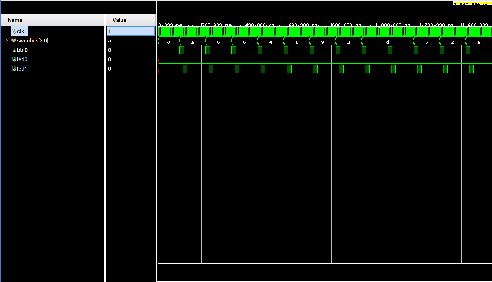

# CECS460_Project_1

# Top-Level Module (`memory_game_top`)

The `memory_game_top` module integrates all the components of the memory game, including BRAM initialization, player input handling, feedback generation, and address management. It connects the switches and button for player interaction, the LEDs for feedback, and the BRAM for storing target values. This module serves as the central controller, ensuring seamless communication between all subsystems to deliver a functional and engaging memory matching game experience.

# BRAM Initialization Module (`bram_init`)

The `bram_init` module initializes a Block RAM (BRAM) with 10 predefined 4-bit random values, which serve as the target values for the memory matching game. During FPGA configuration, the BRAM is preloaded with these values, and the module provides a simple interface to read the stored data based on an input address. This module acts as the core memory component of the game, allowing players to guess and compare their inputs against the stored values. The design ensures efficient and reliable access to the BRAM, enabling seamless gameplay functionality.

# Player Input Module (`player_input`)

The `player_input` module captures the player's 4-bit guess using switches (`SW0–SW3`) and a submission button (`BTN0`). When the button is pressed, the module stores the current state of the switches as the player's guess and signals that a guess has been submitted. This module acts as the interface between the player and the game logic, ensuring that inputs are correctly synchronized with the system clock and ready for comparison against the stored values in BRAM.

# Feedback Module (`feedback`)

The `feedback` module compares the player's 4-bit guess with the corresponding value stored in BRAM and provides visual feedback through LEDs. If the guess matches the stored value, the green LED (`LED0`) lights up to indicate a correct guess. If the guess is incorrect, the red LED (`LED1`) lights up instead.

# Address Counter Module (`address_counter`)

The `address_counter` module controls the game's progression by moving to the next BRAM address after each player guess. When the address reaches the end of the 10-value sequence, it resets to the beginning, creating a continuous loop. This module ensures the game cycles through all stored values, keeping the gameplay organized and engaging for the player.

# Testbench (`memory_game_tb`)

The `memory_game_tb` testbench simulates the behavior of the memory game design by providing inputs (switches and button presses) and observing the outputs (LEDs). It tests various scenarios, including correct and incorrect guesses, as well as the looping mechanism of the BRAM addresses. The testbench ensures the functionality of the game logic, including BRAM access, player input handling, and feedback generation, is verified before implementation on hardware.

# Testbench Waveform

